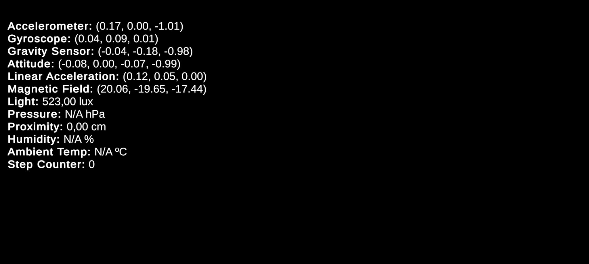
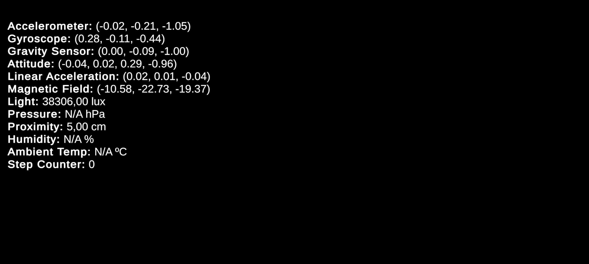

# P08 - II

## Ejercicio 1

### Medida del Laboratorio

### Medida del Patio de la ESIT

### Explicación

Para este ejercicio, se desarrollaron 2 scripts: `SensorManager.cs` y `SensorDisplay.cs`. 

El primero simplemente accede a todos los `devices` del `InputSystem` que se reconocen como sensores y los activa mediante `InputSystem.EnableDevice(sensor)`.

El segundo script accede explícitamente a cada uno de los valores de cada sensor elegido:

* `accelerometer`
* `gyroscope`
* `gravity`
* `attitude`
* `linearAcceleration`
* `magneticField`
* `light`
* `pressure`
* `proximity`
* `humidity`
* `ambientTemperature`
* `stepCounter`

Para posteriormente, modificar el texto de un objeto `TextMeshProUGUI` del canvas añadiendo los valores de cada uno de los sensores.

## Ejercicio 2

Para este ejercicio se desarrollaron dos scripts, uno encargado del control del soldado por completo y otro para mostrar por la UI toda la información relevante acerca de la brújula y el acelerómetro. Al apuntar el dispositivo hacia el norte el soldado se moverá hacia el fondo de la escena, si rotamos la inclinación del móvil en el eje Z se ve como avanza más o menos deprisa con un límite de velocidad permitido. De forma similar, el movimiento del soldado funciona de tal manera que si nos salimos físicamente de un rango definido de latitud y longitud, el personaje no se mueve.